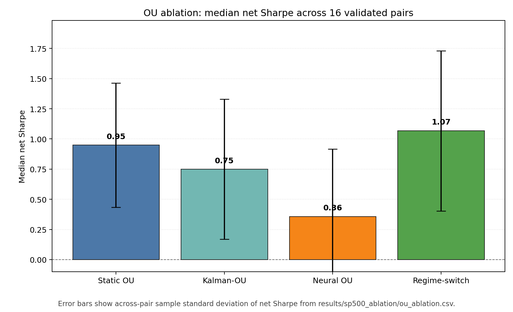
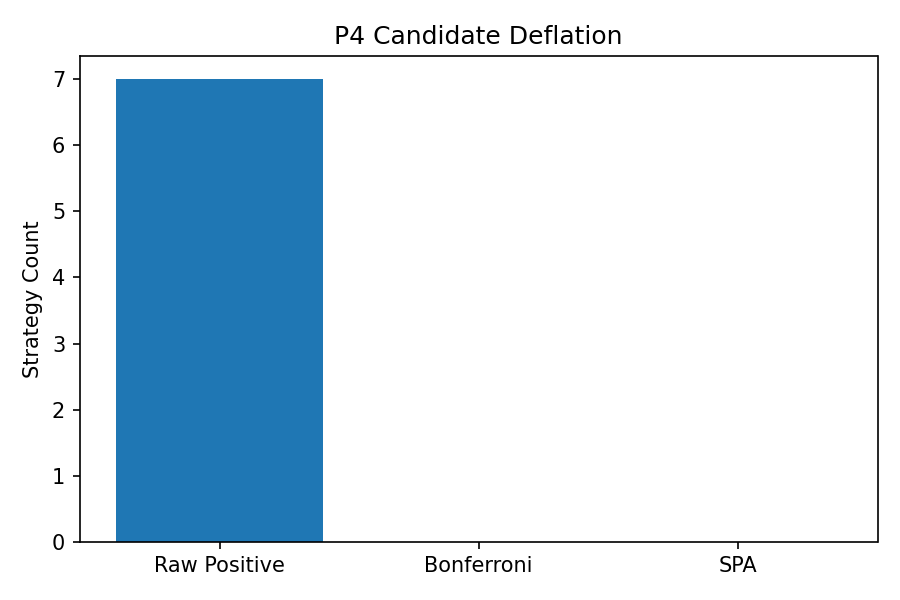
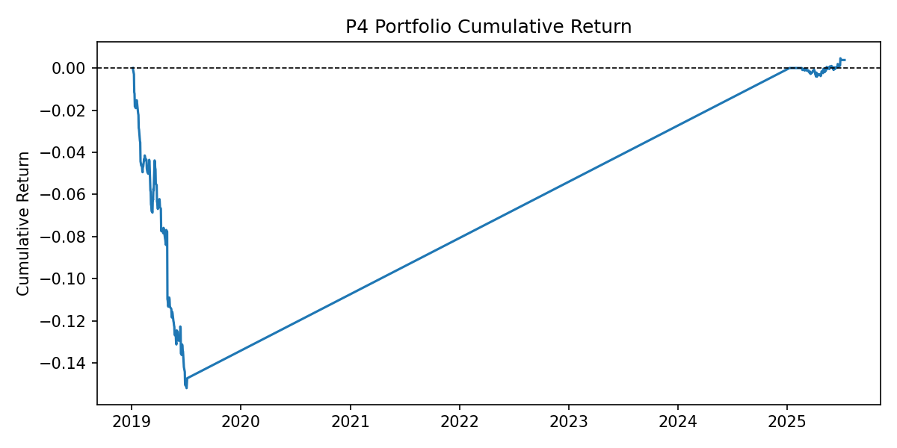
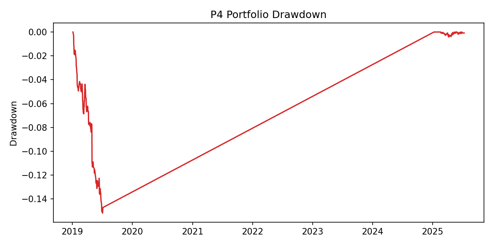
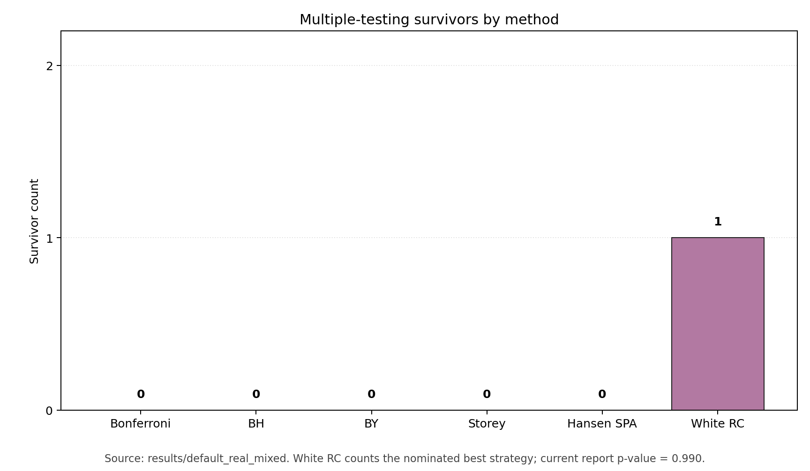
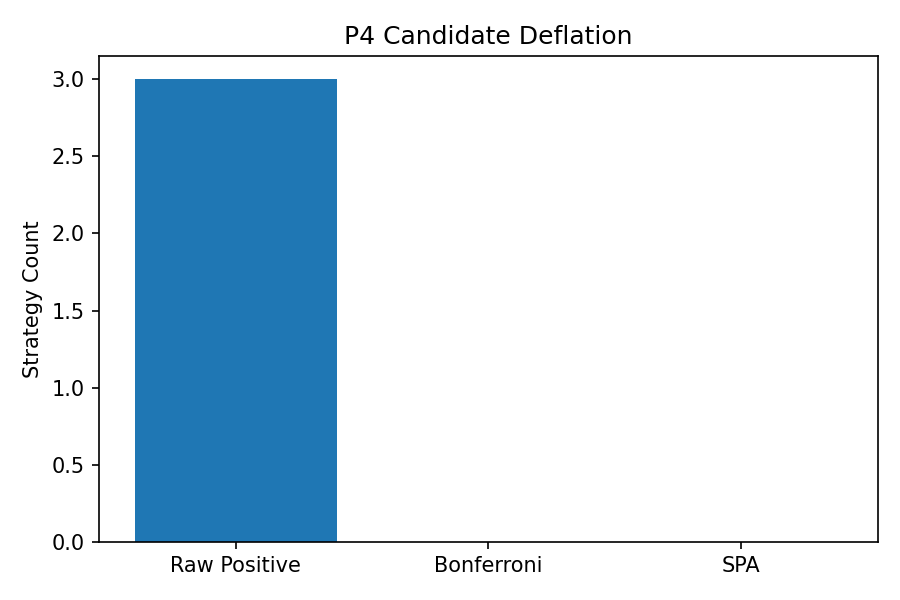
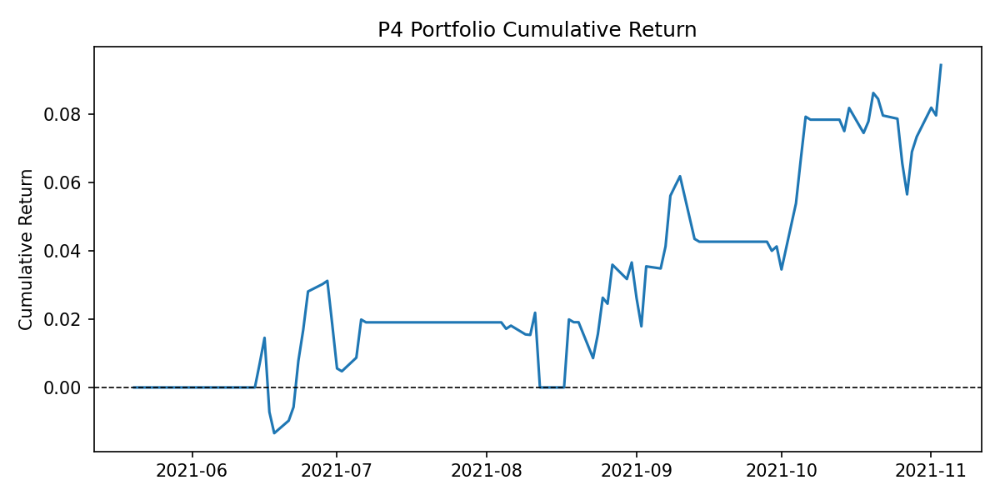
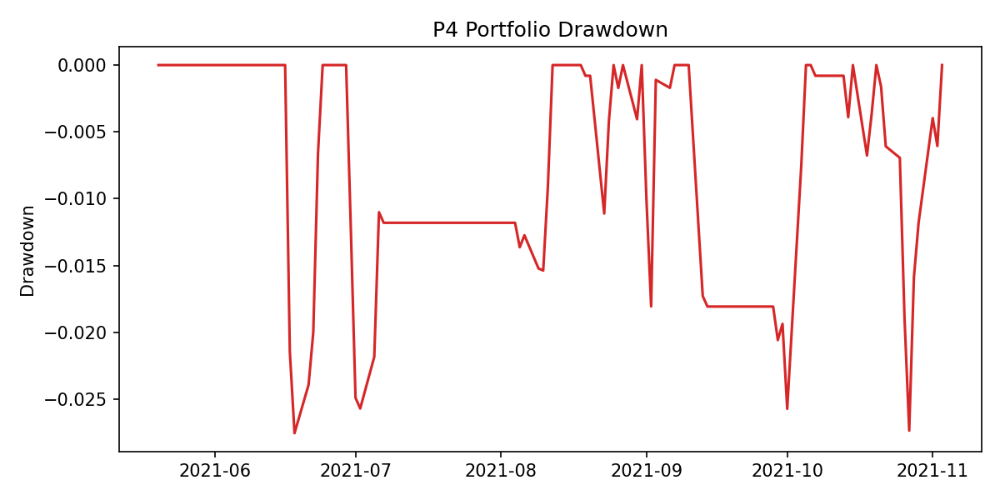

# P4 — S&P 500 Statistical Arbitrage (Johansen · Kalman-OU · Regime-Switch · Hansen SPA)

`Python 3.14+` `60 tests` `MIT` `Public-data stat-arb research`

> P4 is built around one discipline: most attractive spreads should die once
> validation, costs, and multiple-testing correction are applied.

## TL;DR

P4 is not a "pick the single best pair" repo.
It is a research pipeline for testing whether equity and ETF spreads still look
credible after the full gauntlet:
cointegration screening,
OU viability filters,
walk-forward validation,
conservative frictions,
and explicit deflation of data-mined winners.

The current ablation result comes from
`results/sp500_ablation/`,
which compares four OU estimators on the same
16 validated large-cap proxy pairs.

| OU estimator | Median net Sharpe | Read |
| --- | ---: | --- |
| static OU | 0.95 | strong simple baseline |
| Kalman-OU | 0.75 | adaptive, but not better here |
| neural OU | 0.36 | weakest on this sample |
| regime-switch OU | **1.07** | best median result |

The important qualifier is the same one stated in the memo:
`n = 16` is too small to make a strong method-selection claim.
The ranking is useful.
It is not definitive.



At the repo level, the mixed real-universe walk-forward run is intentionally
more sobering.
The stored `default_real_mixed` output shows
29 tested strategies,
7 raw positives,
0 Bonferroni survivors,
0 Hansen SPA survivors,
and a White RC p-value of `0.99`.
That is exactly the point:
multiple-testing discipline should be allowed to reject the story.

## Background

Classical equity statistical arbitrage starts with a reasonable intuition:
stocks in the same business line or theme can wander apart and then mean-revert.
The trap is that a broad search over sectors, ETF families, and rolling windows
can always manufacture a few pretty backtests.
P4 is structured around the idea that the right question is not
"what was the best spread?"
but
"what survives after we pay the multiple-testing bill?"

The repo therefore combines
cointegration-based spread construction,
OU-style mean-reversion modeling,
walk-forward validation,
and explicit family-wise corrections.
Pairs that fail half-life sanity checks are dropped.
Pairs that look good only before costs are dropped.
Pairs that still do not survive Bonferroni,
White's Reality Check,
or Hansen SPA are treated as statistically unconvincing.

Week 5 and Week 6 extend that base in two important directions.
First,
Johansen rank tests and VECM-style tooling make basket cointegration explicit
instead of relying only on pairwise Engle-Granger logic.
Second,
the S&P 500 proxy ablation compares static,
Kalman,
neural,
and regime-switch OU estimators on a common 16-pair panel,
so method comparisons are at least made on identical spreads and identical
signal rules.

## Methods

- Engle-Granger for pair cointegration screening.
- Johansen rank testing for multi-asset cointegration and basket support.
- Static OU estimation as the baseline mean-reversion model.
- Kalman-OU for time-varying `kappa` and `mu` on drifting spreads.
- Neural OU as a higher-capacity estimator baseline.
- Regime-switch OU via a Gaussian HMM with regime-specific reversion speeds.
- Bonferroni for family-wise error control on one-sided mean-return p-values.
- Benjamini-Hochberg for lighter-touch FDR screening.
- Benjamini-Yekutieli for dependency-robust FDR screening.
- Storey q-values as an estimated FDR ranking layer.
- Hansen SPA for bootstrap-based superior predictive ability testing.
- White RC for data-snooping-aware evaluation of the best apparent strategy.

## Headline figures

### Candidate pair deflation by method

The mixed real-universe run is a good visual summary of the repo's philosophy:
the raw candidate count is not the answer.
What matters is how quickly that count collapses under validation and
multiple-testing control.



In `results/default_real_mixed/summary.json`,
the path is
`7 raw positive -> 0 Bonferroni survivors -> 0 SPA survivors`.

### Portfolio cumulative return

The stored mixed-universe basket is not presented as a triumphal equity curve.
It is presented as the economic output of a disciplined pipeline on public data.
The run finishes with a small positive total return,
negative net Sharpe,
and a visibly uneven path.



Summary snapshot:
portfolio total return `0.38%`,
portfolio net Sharpe `-2.73`.

### Drawdown

The drawdown plot is useful because it keeps the README honest.
Even when the cumulative line ends slightly above zero,
the path still suffered meaningful losses and does not support an inflated claim.



The stored maximum drawdown for `default_real_mixed` is about `-15.2%`.

### Multiple-testing survivors

This figure is rendered from the stored mixed-universe result set.
Bonferroni and Hansen SPA come directly from the JSON report.
BH,
BY,
and Storey are recomputed from the saved one-sided p-values in
`results/default_real_mixed/strategy_metrics.csv`.
White RC is shown as the single nominated best strategy from the report.



On the current stored run,
the FWER and FDR procedures all collapse to zero survivors.
The White RC bar is still `1`
because the report identifies one best strategy,
but its p-value is `0.99`,
so it is not evidence of significance.

### Fixture smoke (reproducibility baseline)

The fixture outputs are not the research claim.
They are the reproducibility baseline:
small,
stable,
and good for verifying that the full pipeline still emits the expected shapes.







## What's in the repo

The repo is compact enough to read end-to-end.
The highest-signal pieces are shown below.

```text
p4_stat_arb/
├── configs/
│   ├── p4_base.yaml
│   ├── p4_config.yaml
│   └── p4_smoke.yaml
├── docs/
│   ├── TODO.md
│   └── alpha_engine_trace/
├── results/
│   ├── default_real_mixed/
│   ├── fixture_smoke/
│   ├── real_smoke/
│   ├── sp500_ablation/
│   ├── multiple_testing/
│   └── ou_ablation/
├── scripts/
│   └── render_readme_figures.py
├── src/
│   └── p4/
├── tests/
│   ├── fixtures/
│   └── test_*.py
├── LICENSE
├── Makefile
├── memo.md
├── pyproject.toml
└── README.md
```

Key modules:

- `src/p4/pipeline.py` drives the default end-to-end walk-forward run.
- `src/p4/multiple_testing.py` contains Bonferroni, BH, BY, Storey, White RC,
  Hansen SPA, and related helpers.
- `src/p4/johansen.py` adds Johansen rank tests and basket utilities.
- `src/p4/kalman_ou.py` implements time-varying OU parameter tracking.
- `src/p4/regime_switch.py` implements regime-aware OU estimation and signals.
- `src/p4/run_sp500_ablation.py` runs the 4-way OU comparison used in the
  README TL;DR section.
- `tests/` contains 60 test functions across estimators, selection logic,
  pipelines, and integration paths.

## How to reproduce

```bash
git clone https://github.com/pdwi2020/p4_stat_arb.git
cd p4_stat_arb
python3.14 -m venv .venv && source .venv/bin/activate
pip install -e .
make backtest   # end-to-end
make test       # 60 tests
```

Useful extra entry points once the base environment is up:

- `make run` for the default mixed-universe pipeline.
- `make run-extended` for the regime-aware Wave-2 path.
- `python scripts/render_readme_figures.py` to rebuild the README figures.

## Methodology highlights

- Johansen rank testing matters because pairwise Engle-Granger is not enough
  once the repo moves from pairs to 3-asset baskets.
- Kalman-OU treats the latent OU parameter state as time-varying, which is more
  defensible than one fixed `kappa, mu` pair when spreads drift across windows.
- Hansen SPA bootstraps the null distribution of the best observed
  out-of-sample performance, which is the right antidote to "the winner looks
  great, therefore the process is valid."
- White's Reality Check measures how surprising the best candidate is once the
  whole tested family is acknowledged.
- Capacity constraints are baked into the portfolio layer rather than bolted on
  later, so the repo does not quietly assume infinite liquidity in the overlap
  of related names.
- Trading frictions are explicit:
  half-spread,
  slippage,
  and short borrow are all modeled in the default pipeline.

## Honest caveats

- `n = 16` in the OU ablation is too small for a strong claim that the
  regime-switch estimator is truly better than static OU.
- Regime-switch OU leads the table at `1.07`,
  but the confidence intervals clearly overlap.
- Neural OU underperforms on this sample,
  which is more likely a sample-size and model-capacity issue than a universal
  verdict on neural approaches.
- The live public-data universe is survivorship-biased because it uses current
  S&P 500 membership rather than a point-in-time constituent history.
- The Week 6 large-cap panel is a practical S&P 500-style proxy,
  not a literal historical membership file.
- The mixed-universe stored run is economically weak,
  and the README keeps that visible on purpose.
- White RC in the current stored result nominates one best strategy but does not
  produce a convincing p-value.

## Project structure

Below is the more detailed module-level view of the codebase.

```text
src/p4/
├── backtest.py
├── capacity.py
├── cointegration.py
├── config.py
├── data_loader.py
├── eigenportfolio.py
├── extended_pipeline.py
├── johansen.py
├── kalman_ou.py
├── multiple_testing.py
├── neural_ou.py
├── ou_estimator.py
├── pair_selector.py
├── pipeline.py
├── regime_switch.py
├── run_sp500_ablation.py
├── signal.py
└── sp500_universe.py
```

```text
scripts/
└── render_readme_figures.py
```

```text
tests/
├── fixtures/
│   ├── adv_30d.csv
│   ├── metadata.csv
│   ├── prices.csv
│   └── volume.csv
├── test_backtest.py
├── test_cointegration.py
├── test_config_data_loader.py
├── test_eigenportfolio.py
├── test_extended_pipeline.py
├── test_johansen.py
├── test_kalman_ou.py
├── test_multiple_testing.py
├── test_multiple_testing_extended.py
├── test_neural_ou.py
├── test_ou_signal.py
├── test_pair_selector.py
├── test_pipeline_integration.py
├── test_regime_switch.py
├── test_run_sp500_ablation.py
└── test_sp500_universe.py
```

```text
results/
├── default_real_mixed/
│   ├── candidate_deflation.png
│   ├── daily_strategy_returns.csv
│   ├── multiple_testing_report.json
│   ├── portfolio_cumulative_return.png
│   ├── portfolio_drawdown.png
│   ├── strategy_metrics.csv
│   └── summary.json
├── fixture_smoke/
├── real_smoke/
├── sp500_ablation/
│   ├── ou_ablation.csv
│   ├── pair_candidates.csv
│   ├── pair_universe.csv
│   ├── run.log
│   └── summary.json
├── multiple_testing/
│   └── multiple_testing_survivors.png
└── ou_ablation/
    └── ou_ablation_sharpe.png
```

## References

- Engle, R. F. and Granger, C. W. J. (1987).
  Co-integration and error correction:
  representation,
  estimation,
  and testing.
  *Econometrica* 55(2).
- Johansen, S. (1991).
  Estimation and hypothesis testing of cointegration vectors in Gaussian VAR
  models.
  *Econometrica* 59(6).
- White, H. (2000).
  A reality check for data snooping.
  *Econometrica* 68(5).
- Hansen, P. R. (2005).
  A test for superior predictive ability.
  *Journal of Business & Economic Statistics* 23(4).
- Storey, J. D. (2002).
  A direct approach to false discovery rates.
  *Journal of the Royal Statistical Society B* 64(3).
- Benjamini, Y. and Hochberg, Y. (1995).
  Controlling the false discovery rate:
  a practical and powerful approach to multiple testing.
  *Journal of the Royal Statistical Society B* 57(1).
- Benjamini, Y. and Yekutieli, D. (2001).
  The control of the false discovery rate under dependency.
  *Annals of Statistics* 29(4).
- Lopez de Prado, M. (2018).
  *Advances in Financial Machine Learning*.
  Wiley.

## Project context (sister repos)

This repo is project `P4` in a five-project quant research portfolio.
The sister repos are:

- [`p1_factor_research`](https://github.com/pdwi2020/p1_factor_research) —
  cross-sectional equity factor research with BARRA-style risk control and
  Almgren-Chriss capacity analysis.
- [`p2_market_maker`](https://github.com/pdwi2020/p2_market_maker) —
  Avellaneda-Stoikov market making with HJB derivation and queue-reactive
  microstructure extensions.
- [`p3_vol_surface`](https://github.com/pdwi2020/p3_vol_surface) —
  volatility surface dynamics with SVI,
  SSVI,
  and rBergomi calibration work.
- [`p5_gpu_mc_exotics`](https://github.com/pdwi2020/p5_gpu_mc_exotics) —
  GPU Monte Carlo for exotic options under Heston,
  Bates,
  and related models.

## License

MIT.
See `LICENSE`.
